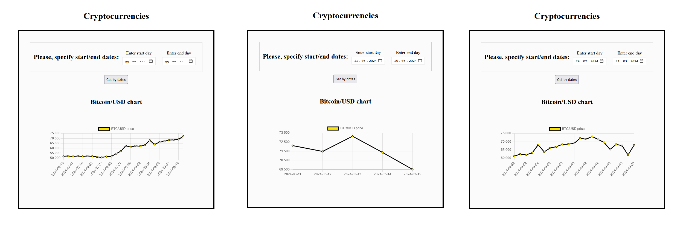
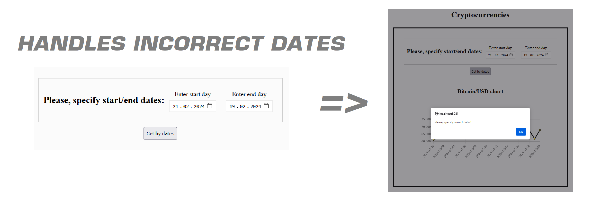

# Cryptocurrency Monitor Web App

This light project helps to analyze and monitor cryptocurrency rates.
You can see with which indicators the daily price of Bitcoin closes, having previously determined the period. **Bitcoin is shown as an example!**


## Demo

[Watch demonstrating video about how this Web Application works](https://youtu.be/SC39yV5yZAw)





## Tech Stack

Technologies that used to create an efficient and well-organized environment for the development and management of the Cryptocurrency API and Web Application.

Backend:
**Java 21**,
**Spring Boot**,
**Mapstruct**,
**Lombok**,
**Polygon API**, 
**Maven**

Frontend:
**Vue 3**,
**JavaScript**,
**ChartJS**,
**Moment.js**,
**CSS**


## Run Locally

**This API requires JDK 21**

- Clone the project

```
$ git clone https://github.com/fedorovychh/cryptocurrency-monitor.git
```

- Open backend API in Inteliji IDEA

- Add your access key from [polygon.io](https://polygon.io/) to application.properties

- Run API

- Go to frontend side folder

- Open terminal

- Install next modules:

```
$ npm install vue

$ npm install

$ npm install chart.js

$ npm install moment
```
- Run app:

```
$ npm run serve
```
- Go to http://localhost:8081